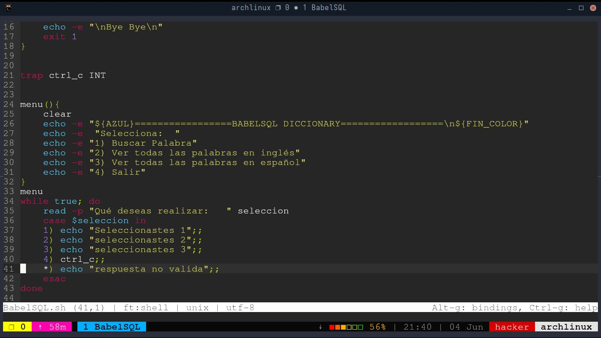
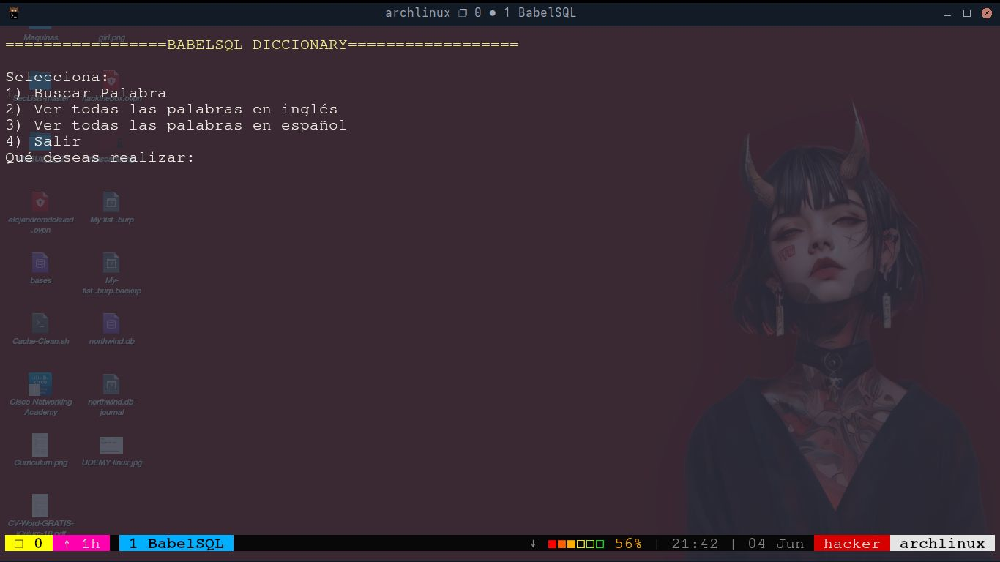
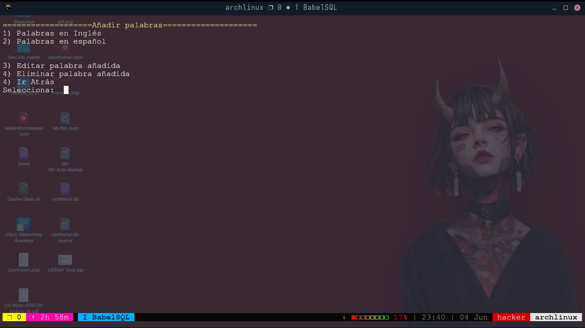
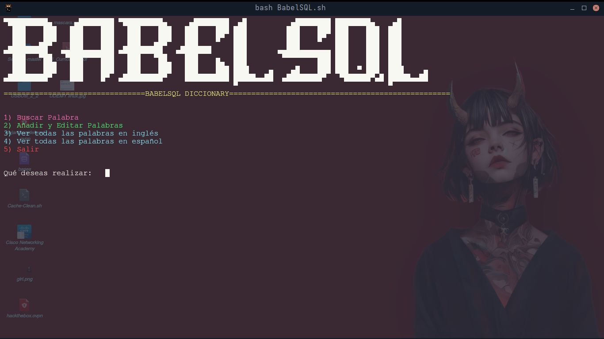
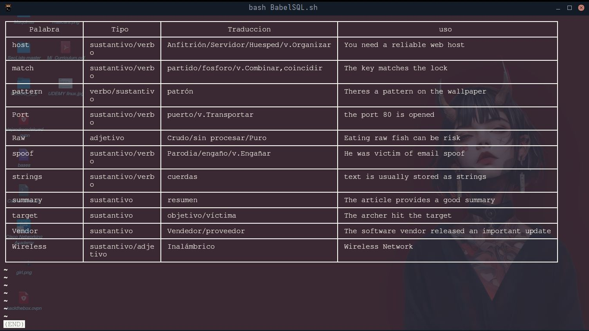

# BabelSQL Development-log

   Últimamente he estado aprendiendo **bases de datos, SQL, MySQL, SQLite** entre otras, con el fin de conocer a
profundidad las vulnerabilidades web **SQLI (SQL Inyection)** , lo cual he decidido realizar un proyecto
para poner en práctica lo aprendido, después de estar mucho tiempo pensando sobre que hacer, quería
algo útil tanto para mí como para otras personas, y decidí crear un diccionario técnico 
en **Español e Inglés**

   Un diccionario donde cada palabra nueva que se vaya aprendiendo se pueda agregar al programa por si
en algún momento se olvida poder consultarla y ver algunos ejemplos de uso. Este programa decidí
realizarlo en **Bash** y bases de datos utilizando **SQLite3** para poner en práctica los conocimientos
aprendidos.

## Estructura

Por ahora ésta es la estructura que tengo pensada para el proyecto:

**adder.sh**  (Script con bucle for para añadir palabras a la base de datos, posiblemente le cambie 
el nombre, o posiblemente lo incluya directamente al script principal)

**BabelSQL.sh** (Script principal del proyecto, nombre inspirado en la **Torre de Babel**, Tendrá el menú
interactivo con diferentes opciones)

**Installer.sh** (Instalador (podría considerarlo))

**Words.db** (Lo mas importante, la base de datos con todas las palabras, descripcion, tipo, ejemplos
y otras cosas que vaya cconsiderando sobre la marcha,)

**Development-log** (Carpeta con capturas y proceso de como ha sido el proceso de creación de la herramienta)


# Inicio (Miércoles 04/06/2025 9:11 PM)



Aquí realicé un poco del esqueleto del menú principal y controlando de forma muy básica el flujo
del programa.




Solo le falta algo color y un banner para mejorar la apariencia pero ya es funcional.

Para continuar con el desarrollo del menú primero debo empezar a crear la base de datos,
entonces en **SQLITE3**, ejecuto este comando para crear la primera tabla que contendrá los datos de las palabras en inglés:

```
CREATE TABLE Ingles(id INTEGER PRIMARY KEY AUTOINCREMENT,Palabra TEXT,Tipo TEXT, Traduccion TEXT,Descripcion TEXT,Uso TEXT);
```

Y la tabla con los datos de las palabras en español:

```
CREATE TABLE Español(id INTEGER PRIMARY KEY AUTOINCREMENT,Palabra TEXT,Tipo TEXT, Traduccion TEXT,Descripcion TEXT,Uso TEXT);
```

Con esto ya tendría creado las tablas, pero ahora faltan las palabras y sus datos, escribir
todo el código SQL para añadir datos uno a uno es algo tedioso, por lo que he decidido hacer
un bucle para añadir las palabras y sus datos mucho más rápido y eficiente que estar haciendolo uno a uno

Añadiré una nueva opción al menu principal con esto.




Ésta es una nueva sección del menú el cual nos permitirá añadir,editar y eliminar palabras añadidas.

Ahora que he añadido varias palabras, voy a empezar a trabajar la opción de ver todas las palabras 
añadidas.


Ya hoy es Viernes 6 de junio, y he estado aprendiendo más conceptos de bases de datos, también he
avanzado con el desarrollo del proyecto, ya tiene un funcionamiento básico solo falta agregarle
palabras a la base de datos 

# Terminado el Proyecto (Sábado 07/06/2025 4:07)

	Bueno, he terminado el proyecto, y así quedó:
	


Solo añadí unas palabras de prueba ya con el tiempo vaya aprendiendo palabras técnicas en inglés las iré agregando



# Conclusión

El proyecto **BabelSQL** es un proyecto simple el cual fue una excelente práctica, lo que me permitió profundizar un poco más
el entendimiento de bases de datos, quize aprender bases de datos para profundizar en como funcionan para poder aplicar estos
conocimientos en el Ataque **SQLI**, Lo que comenzó como una idea para un proyecto práctico, evolucionó en un diccionario técnico
interactivo bilingüe (español e inglés), diseñado tanto para mi uso personal como para cualquier persona que desee gestionar
y consultar vocabulario técnico aprendido.

Durante el desarrollo he puesto en práctica conceptos de  **Bash scripting** para la lógica del programa y **SQLite3** para la
gestión de datos, creando así ésta herramienta, durante el desarrollo de la herramienta, al momento de perdirle datos al usuario
me dí de cuenta de la importancia de sanitizar el código para evitar errores y posibles inyecciones SQL, con solo colocar una 
comilla simple ('') se puede llegar muy lejos e incluso alguien podría llegar a borrar la bases de datos completa.

Aunque **BabelSQL** por ahora solo contiene algunas palabras de prueba, la base de datos está lista para crecer a medida de que
se vayan  adquieriendo nuevas palabras técnicas.

#### Este proyecto no solo demuestra lo aprendido, sino que también sirve como una plataforma para el aprendizaje continuo.

Autor: **Alejandro Moncada**
Correo: [Gmail](emailto:alejandromdekuedit@gmail.com)

