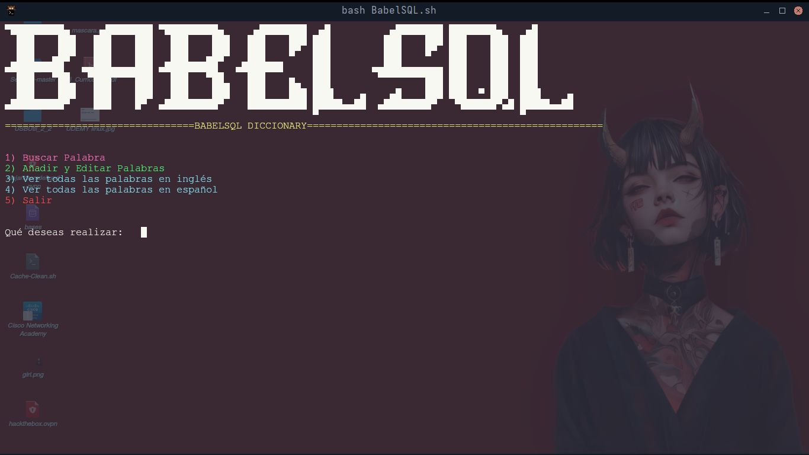
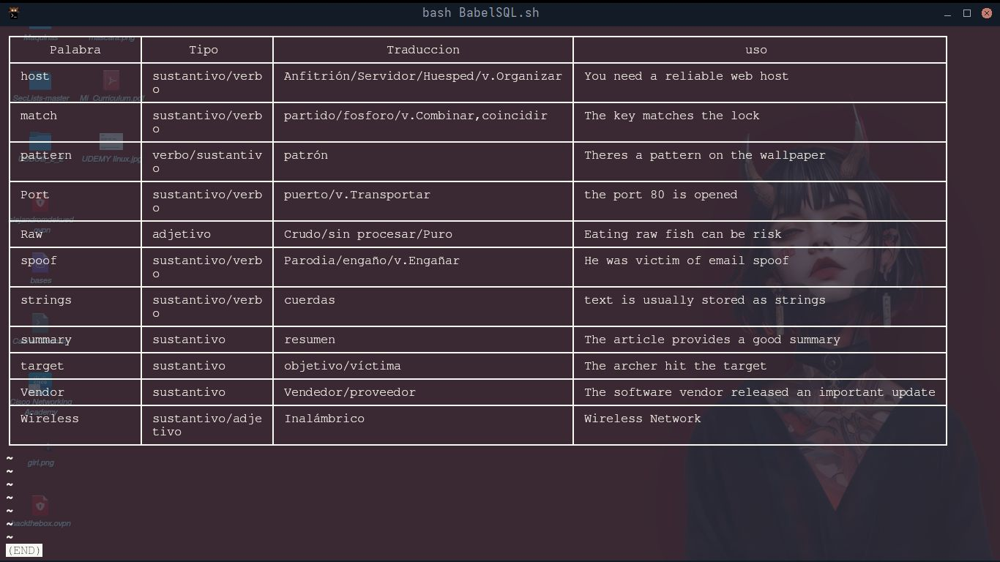

# 🎯 BabelSQL

**BabelSQL** es un diccionario técnico bilingüe desarrollado en **Bash** con soporte de base
de datos **SQLite3**. Es una herramienta simple pero funcional que permite:

• Añadir nuevas palabras (inglés/español)
• Buscar palabras
• Ver todas las palabras almacenadas
• Editar y eliminar entradas


El nombre fue inspirado en la mítica **Torre de Babel** , simbolizando la diversidad lingüística y
el intento de conectar idiomas a través de tecnología.





# 🧠 Objetivo del Proyecto

Este proyecto nació como una forma de aprender conceptos básicos de **bases de datos**, 
**comandos SQL** y scripting en **Bash**, enfocado en la comprensión de cómo funcionan las
inyecciones **SQL (SQLI )** desde una perspectiva básica.





# ⚠️ Notas sobre Seguridad

Durante el desarrollo, se notó que el código no sanitiza completamente las entradas del usuario
lo cual podría permitir inyecciones SQL si se ingresa texto malicioso. Esto fue parte del aprendizaje:
entender la importancia de validar y escapar correctamente los inputs antes de insertarlos en 
consultas **SQL.**


# 📁 Carpeta development-log
Esta carpeta contiene material gráfico y reflexivo del proceso de desarrollo del proyecto. Fue creada con el objetivo de:

• Registrar visualmente el progreso del programa
• Mostrar capturas de pantalla durante las distintas fases de construcción
• Documentar decisiones de diseño e implementación
• Facilitar la revisión futura del código y su evolución

# ⚙️ Requisitos Técnicos

	• Bash shell
	• SQLite3 instalado
	• Sistema operativo Unix/Linux


# ▶️ Cómo Ejecutar el Proyecto

Clona o descarga el proyecto
Accede al directorio:

```
cd BabelSQL
```

Da permisos de ejecución al script:

```
chmod +x BabelSQL.sh
```

Finalmente, ejecuta el script:

```
bash BabelSQL.sh
```


# 🔍 Características Principales

✅ Menú interactivo

✅ Gestión de palabras (CRUD básico)

✅ Soporte multilenguaje (inglés/español)

✅ Interfaz de texto colorida

✅ Uso de SQLite3 como motor de base de datos


Este proyecto representa una práctica valiosa en el aprendizaje de scripting en Bash y manejo básico de bases de datos.

# 💼 Autor

Alejandro Moncada
Correo: alejandromdekuedit@gmail.com
